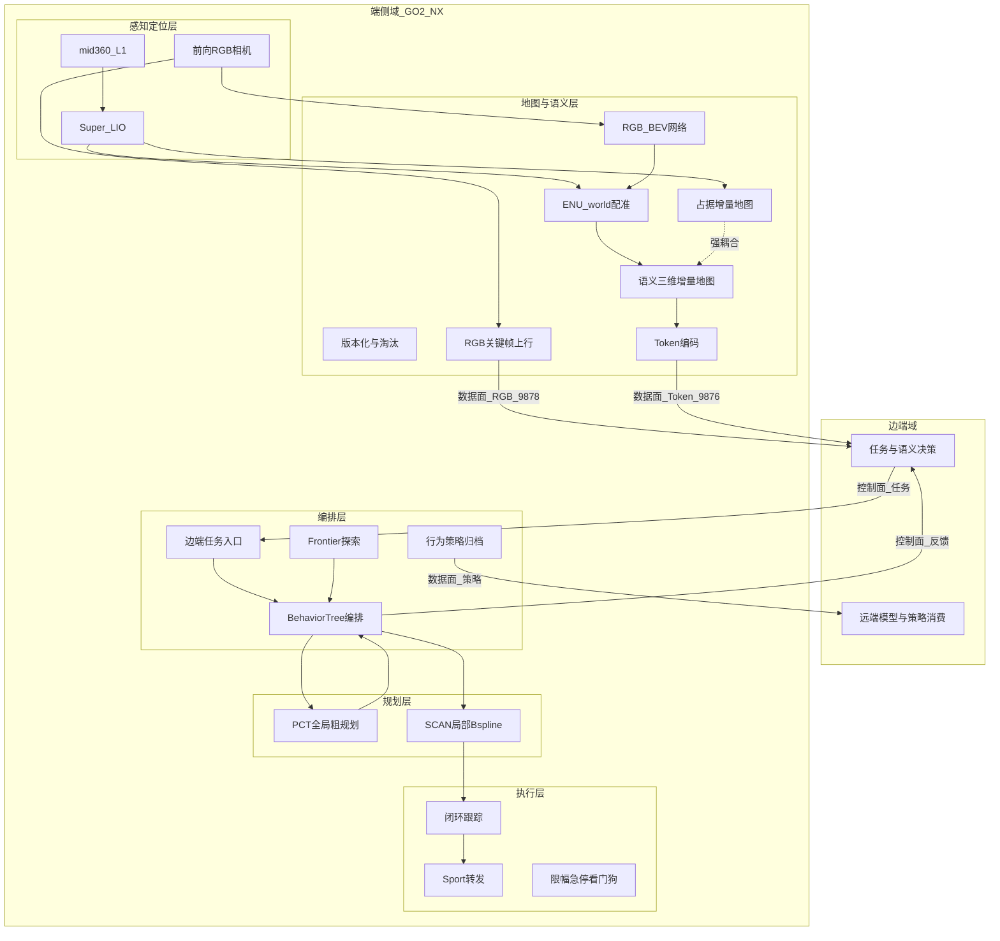
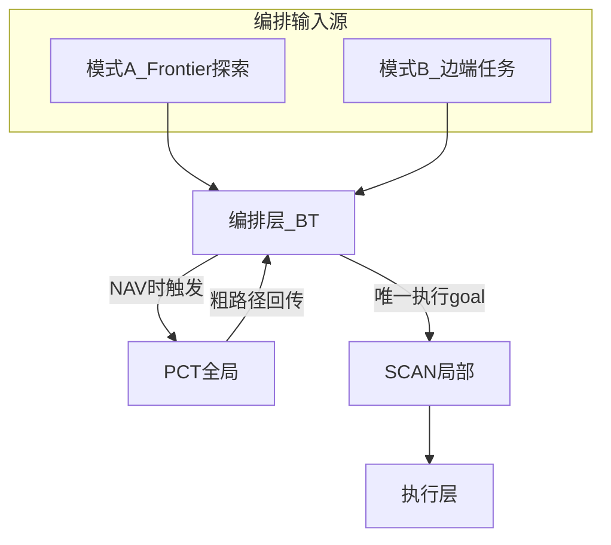
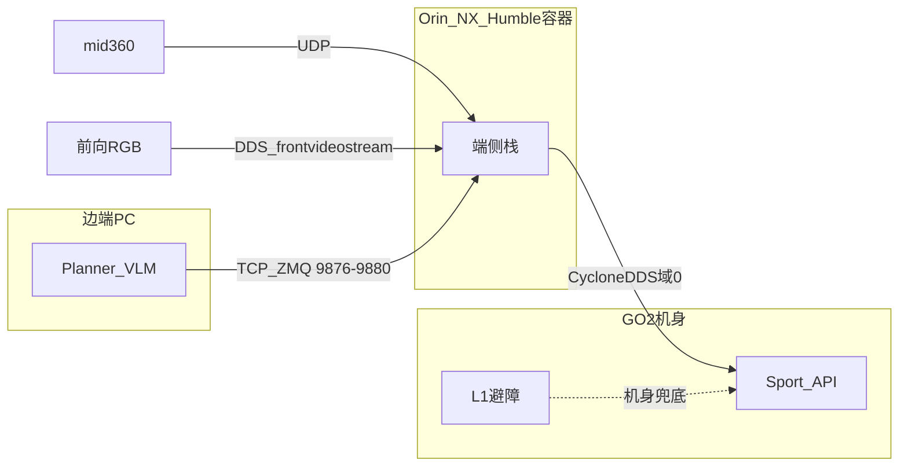
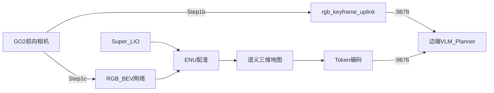

# 架构图草稿（非权威）

> **状态**：草稿 · 不进架构正文  
> **权威图**：[`架构_端侧系统架构.md`](../架构/架构_端侧系统架构.md) §2 / §5 的 PNG（`assets/架构_逻辑分层.png`、`assets/架构_双模式.png`）  
> **重新导出 PNG**：`python3 scripts/dev/export_arch_diagram_png.py`  
> **交互预览**：Cursor Canvas `motionslam-system-arch.canvas.tsx`（逻辑分层 + 双模式）

本文保留 **mermaid 可编辑源** 与 **未纳入 PNG 的扩展视图**（部署、BEV 链路），供改图 / 评审用。定稿后由人工决定是否合并进架构正文。

---

## 1. 逻辑分层（mermaid 草稿）

对应 PNG：`assets/架构_逻辑分层.png`

**PNG 布局约定**（定稿）：五行网格；边端 **任务与语义 = 第 2 行**，**远端模型消费 = 第 4 行**。

---

## 2. 双模式（mermaid 草稿）

对应 PNG：`assets/架构_双模式.png`

---

## 3. 部署拓扑（扩展视图 · 未出 PNG）

架构正文 §3 仍用文字 + 下表；图仅草稿。

---

## 4. BEV–RGB 链路（扩展视图 · 未出 PNG）

架构正文 §2.1 文字为准；下图便于 Step 1b/1c 评审。

---

## 5. 变更记录

| 日期 | 说明 |
|------|------|
| 2026-08-12 | 权威图改为 PNG；mermaid 与部署/BEV 扩展视图迁入本草稿 |
