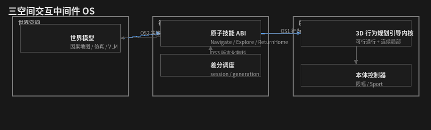
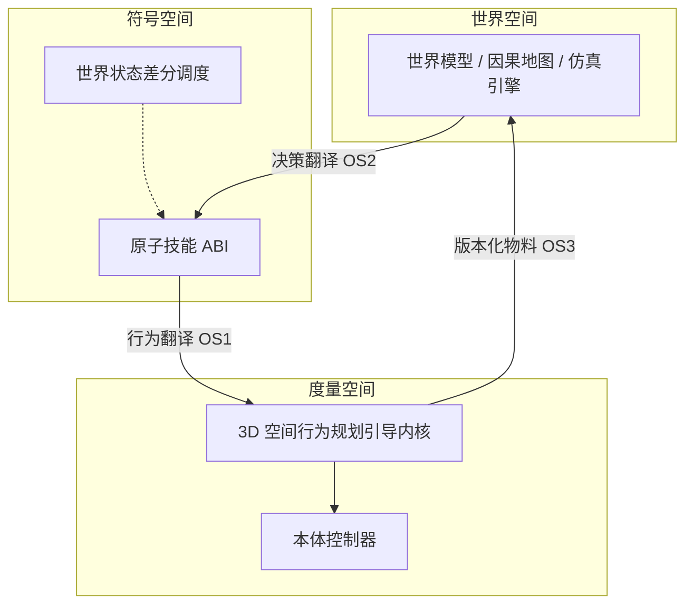
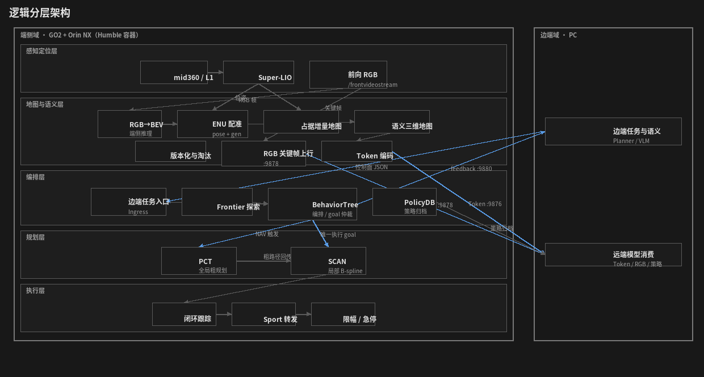
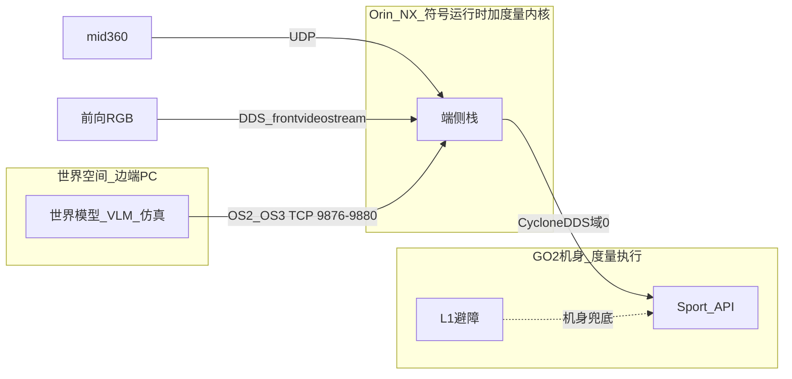
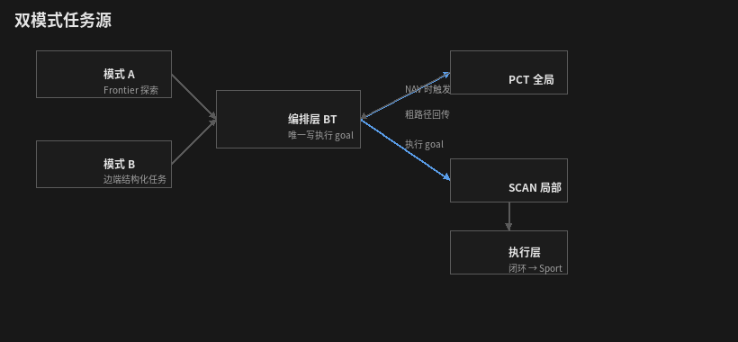

# 端侧系统架构

> **版本**：2026-08-19 · **目标系统架构**（最终要建成的端侧「操作系统」结构）  
> 阶段与进度 **只** 见 [项目规划 — Demo 1](../规划/项目规划_Demo1三步.md)。本文不是已完成清单。  
> 边端消息契约见 [边端协同接口规范.md](../项目规范/边端协同接口规范.md)。  
> 启停与 profile 见 [Demo阶段3D_runbook.md](../运维/Demo阶段3D_runbook.md)。

本文描述 **稳态目标态**：与「当前做到第几步」解耦。实现进度不改变本章定义的分层与边界；勾选与卡点不得从本文反推。

导航链路、BT、PCT、SCAN 是本 OS 在度量空间上的 **实现锚点与第一个原子技能**，不是产品本身。

---

## 1. 系统定位

端侧与边端共同构成一套 **度量空间—符号空间—世界空间** 的空间交互中间件 OS：翻译可以跨空间，**执行权不得跨空间下沉**。

端侧在 Jetson Orin NX（Humble 容器）上承载 **度量空间内核 + 符号空间技能运行时**；边端 PC 承载 **世界空间**（VLA / 世界模型 / 仿真引擎）及符号决策。两边通过 **控制面（任务/反馈）** 和 **数据面（子图/RGB/Token/策略）** 协同。

- **世界空间** 做因果与任务决策；端侧不做大模型实时推理。
- **度量空间** 做运动安全与连续行为；边端不得下发底层速度指令。
- **符号空间** 是唯一技能表与仲裁面：把世界意图变成可调度技能，把度量结果译回世界状态。

逻辑分层（感知 / 地图 / 编排 / 规划 / 执行）是该 OS 在单机上的展开，见 §3。

---

## 2. 三空间交互中间件 OS



> 图源：`assets/架构_三空间.png` · 重新生成：`python3 scripts/dev/export_arch_diagram_png.py`



### 2.1 三个空间

| 空间 | 存什么 | 谁写 | 谁禁止写 |
|------|--------|------|----------|
| **度量空间** | 几何、占据、可行通行、连续轨迹、限幅速度 | 感知、规划内核、本体控制器 | 世界模型、边端任务 JSON |
| **符号空间** | 技能名、任务生命周期、失败类型、仲裁结果 | 编排 / 技能运行时 | 规划器直写执行速度 |
| **世界空间** | 因果、物体/场景语义、策略记忆、仿真假设 | 边端世界模型 / VLM / 仿真 | `/cmd_vel`、`/motion/command` |

语音、空间感知、因果地图、上游世界模型、仿真引擎、本体控制器都挂在这三个空间上，**不**各自直连电机。OS 只提供翻译、技能 ABI、物料代数与调度，不代替任一空间内部的算法。

### 2.2 翻译面

| ID | 翻译 | 方向 | 目标契约 |
|----|------|------|----------|
| **OS1** | 度量 → 符号：行为翻译 | 轨迹/占据/失败 → 技能终态 | `reached` / `stuck` / `glass_trap` / `plan_fail` / `link_lost` 等稳定失败类型，而不是日志字符串 |
| **OS2** | 符号 ↔ 世界：决策翻译 | 世界意图 ↔ **行为模式信封** | 世界模型产出物模型 JSON（机器人×场景×策略×动作×模型），不产出速度；端侧把 `services.actions` 译成技能 syscall；成败与异常经 `events` 译回世界状态代数 |
| **OS3** | 度量 ↔ 世界：物料交互 | 3D 增量 ↔ 假设/禁行 | 点云/BEV/Token 带 `session` / `context_generation`；世界假设回注度量须走虚拟障碍/重规划约束，禁止直写执行口 |
| **OS4** | 操作 → 原子技能 | 机器人动作 → syscall | 技能有名字、资源配额、超时、失败语义、可替换实现；路径只是技能瞬时产物 |

**OS0（总约束）**：翻译可跨空间；**执行只发生在度量空间**。世界空间不得下发 `/cmd_vel` 或 `/motion/command`（与 A5、控制面禁止条款同一内核）。

### 2.3 原子技能

技能是 OS 的系统调用。符号空间只调度技能，不调度折线点。

| 技能 | 意图 | 度量内核用法 |
|------|------|----------------|
| **Navigate** | 定向到达 | 3D/可行通行引导 + 连续局部行为 + 限幅下发 |
| **ReturnHome** | 断网/陷阱/显式返航 | 不依赖世界模型；度量层可独立完成 |
| **ExploreFrontier** | 长航时扩图 | 内核只作可选粗引导，选点在符号空间 |
| **RecoverGlass** | 玻璃等不可见障碍恢复 | 虚拟障碍并入度量地图后重规划或返航 |

**Navigate 是嵌入式资源受限场景下的第一个原子技能。** 其 ABI 目标形态：

```text
Navigate(goal, session, context_generation, resource_quota)
  → { reached | failed, reason, policy_digest }
```

实现可演进（典型锚点：PCT 粗引导 + SCAN 连续局部 + 技能运行时写唯一执行路径 + forwarder → Sport），但 ABI 不随实现替换而变。航点 YAML、`/global_path` 折线是技能运行时的瞬时工件，**不是** OS 记忆主键。

技能运行时（典型：BT 或等价生命周期机）只负责 **单个技能的启动、监视、取消、恢复**。世界级任务编排不由该运行时承担，见 §2.4。

OS2 下行的 JSON 按大疆上云 API 的物模型组织（信封 `tid/bid/method` + `data` 七块：`profile` 机器人、`properties` 场景与模式态、`services` 动作、`policy` 行为策略、`models` 所用模型、`events` 异常日志、`world_fragments` 世界片段引用）。**BehaviorMode 是 OS2 的输出单元**；技能是 OS4 的 syscall。契约见 [边端协同接口规范.md](../项目规范/边端协同接口规范.md) §2。

### 2.4 目标能力（五条）

这些是 OS 稳态要建成的能力，不是五套互斥产品。

| 能力 | 定义 | 明确不是 |
|------|------|----------|
| **3D 空间行为规划引导内核 + 导航原子技能** | 内核提供可通行几何与局部连续行为；`Navigate` 只是其上的一个 syscall | 内核不等于产品；导航不是唯一技能 |
| **以世界模型为底座的任务调度** | 调度对 **世界状态代数**（`session` / `context_generation` / 物体假设）做差分：代数变了则使技能失效或重规划 | 传统 RPC（`call Navigate(x,y)` 且不管代数）不是世界级调度 |
| **行为策略数据库** | 记忆「这片场景用了何种技能与控制器选择」：通行策略、降速、返航、失败码 | 不把原始路径点、航点序列当主键；路径可作附件 |
| **版本化 3D 物料的物理闭环** | 真实三维数据按代数生产/消费；真机执行痕迹必须对得上某一代物料 | 无代数的「又跑了一次导航」不算闭环 |
| **异构多机协同** | 共享技能 ABI 与物料代数；不同机、仿真引擎、不同控制器可替换实现 | 不共享 `/cmd_vel`；不把 Sport 协议当跨机总线 |

PolicyDB 目标态：**归档上送世界空间**，不作为端侧实时规划的反馈输入（避免记忆模型在端侧闭环决策）。

### 2.5 与逻辑分层的对应

| OS 空间 | 逻辑层（§3） | 边端 |
|---------|--------------|------|
| 度量 | 感知定位、地图占据、规划内核、执行 | 不参与连续控制 |
| 符号 | 编排 / 技能运行时、技能 ABI、PolicyDB 写出 | 控制面 JSON 只到符号入口 |
| 世界 | Token / RGB / 子图的数据面出口 | VLM、世界模型、仿真、策略 ingest |

双模式（探索 / 边端任务）是符号空间的两种 **意图源**，共用同一度量内核与同一技能表，见 §6。

### 2.6 与智源 RoboOS 的对照（目标态）

智源 RoboOS 是公开的跨本体具身框架：**云端大脑 RoboBrain + 小脑技能库 + 实时共享记忆**（空间 / 时间 / 本体），强调即插即用技能、任务分解、反馈纠错与群体协同。本 OS **不做成它的翻版**。差异化在度量内核与执行边界；对齐的是「成 OS 所必需的运行时」，不是技能商店或多机演示。

| 智源 | 本 OS 对应 | 对齐方式 |
|------|------------|----------|
| 云端大脑 | 世界空间（边端模型） | 决策在世界空间；端侧不做大模型实时推理 |
| 小脑技能库 | OS4 技能 ABI + 度量内核 | 技能是 syscall；**内核不是黑盒**，3D 几何可版本化 |
| 共享记忆 | OS3 物料 + PolicyDB + 世界片段 | 记忆在世界空间查询；端侧只生产带代数的引用 |
| Profile 模板 | `thing_envelope.profile` | 本体能力建模；不是直控关节 |
| MCP / 技能商店 / 群体 | — | **稳态可演进，不是本 OS 内核定义** |

**必须保留、不向智源看齐：**

- 度量空间是一等公民（PCT/SCAN 等引导内核可替换实现，ABI 不变）。
- OS0：世界空间不得下发 `/cmd_vel` 或 `/motion/command`。
- PolicyDB 记行为策略与控制器选择，不记路径主键；**不**把记忆模型回灌端侧实时规划。
- 不用端到端 VLA 替换度量内核。

**稳态还缺的四件运行时**（报文七块解决的是「长什么样」；下列解决「进系统之后谁调度、谁记忆、谁纠错」）。进度只在规划勾选。

| ID | 运行时 | 定义 | 明确不是 |
|----|--------|------|----------|
| **RT-1** | OS4 Skill Registry | 技能可注册：名字、配额、超时、取消、失败语义、**同一 ABI 可替换实现** | 不是再焊一套 BT if；不是技能商店 |
| **RT-2** | OS2 闭环 | 上行 `events.reason` 由世界模型消费，改 `policy.mode_id` 或重发 `services` | 不是单向下发完事；不是端侧本地大模型重规划 |
| **RT-3** | OS3 记忆面 | 同一 `bid` 下可查询 **空间 / 时间 / 本体** 三类记忆 | 不是把点云塞进控制 JSON；不是端侧记忆决策 |
| **RT-4** | 监控树 | `tid` → mode → skill → kernel digest；与栈 lifecycle、BT phase **分名可映射** | 不是三套状态机各说各话 |

`mode_id` 映射到度量内核参数（如限速、玻璃感知、SCAN 行为集）属于 RT-1 的实现义务：没有映射，行为模式只是字符串。分层任务 DAG 属于世界空间调度，单技能 `Navigate` 不承担。MCP、技能商店、跨本体群体、云端亚十毫秒宣传指标 **不是** 本 OS 闭环条件。

```text
智源：  任务 → 大脑分解 → 技能队列 → 小脑执行 → 共享记忆 → 再规划
本 OS： 任务 → 物模型信封 → 技能 Registry → 度量内核执行
              → 世界片段+策略归档 → events 回世界 → 再发 execute
```

---

## 3. 逻辑分层架构



> 图源：`assets/架构_逻辑分层.png` · 重新生成：`python3 scripts/dev/export_arch_diagram_png.py`  
> mermaid 可编辑草稿：[`docs/_inbox/架构图草稿_mermaid与扩展视图.md`](../_inbox/架构图草稿_mermaid与扩展视图.md)

| 层 | 职责 | 不负责 |
|----|------|--------|
| **感知定位** | 位姿、点云、**前向 RGB 帧**、可选回路/local_map | 任务决策、写执行 goal、BEV 推理 |
| **地图与语义** | 占据/语义增量、**RGB→BEV→ENU 配准**、tile 生命周期、Token 生产、RGB 关键帧上行 | 选导航目标、发运动指令 |
| **编排** | 技能生命周期、frontier / 边端任务仲裁、唯一执行路径、恢复、策略归档 | B-spline 优化、Sport 协议细节、世界模型推理 |
| **规划** | 度量内核：PCT 全局粗引导；SCAN 局部连续行为 | 解析边端 JSON；绕过编排写执行路径 |
| **执行** | 轨迹跟踪、Sport 下发、安全限幅 | 改任务、改全局路径、改技能 ABI |

---

## 3.1 BEV–RGB 语义链路（度量 → 世界物料）

前向单目 RGB 与 LiDAR/LIO **并行输入**，在地图层完成 BEV 语义生产。语义地图是世界空间的物料，**不经技能运行时做实时决策**；玻璃等虚拟障碍回注度量地图属于 OS3，不是世界模型直控运动。

```text
GO2 前向相机 (/frontvideostream, CycloneDDS)
        ├─ RGB 关键帧上行 ──TCP:9878──→ 世界空间（pose + context_generation 对齐）
        └─ RGB→BEV 网络（端侧推理）
                                    ↓
                          ENU/world 配准 ← Super-LIO 位姿 + context_generation
                                    ↓
                          语义三维增量地图（与占据地图强耦合）
                                    ↓
                          Token 编码 ──TCP:9876──→ 世界空间 decode
```

落地进度见规划 1c，不在本图勾选。

| 环节 | 归属 | 说明 |
|------|------|------|
| RGB 采集 | 度量 / 感知 | 机身 DDS `Go2FrontVideoData`；容器内订阅 `/frontvideostream` |
| BEV 推理 | 度量 / 地图 | 单目 RGB → BEV 特征/语义栅格；**不在边端做大模型** |
| ENU 配准 | 度量 / 地图 | 以 LIO `world` 系为锚；元数据带 `session` / `context_generation` |
| 语义地图 | 度量 / 地图 | 与占据增量 **强耦合**；版本化/淘汰与 MapLife 联动 |
| RGB 关键帧上行 | OS3 数据面 | 实现锚点：`rgb_keyframe_uplink`；schema `motionslam.rgb_forward.v1` |
| Token 上行 | OS3 数据面 | `:9876`；世界空间 VLM / 世界模型消费 |

---

## 4. 部署架构

> 部署 **mermaid 图**见草稿 [`架构图草稿_mermaid与扩展视图.md`](../_inbox/架构图草稿_mermaid与扩展视图.md) §3。

异构多机目标态：多台机器人 / 仿真引擎共享 §2.3 技能 ABI 与物料代数；每台自带度量内核与本体控制器。下图是 **单机 Go2 + 单边端** 的最小部署（实现锚点）。



| 节点 | 角色 |
|------|------|
| 边端 PC | 世界空间：语义决策、消费 Token/子图/策略、下发 **技能级** 任务 |
| Orin NX 容器 | 符号运行时 + 度量内核；host 网络 + CycloneDDS 域 0 |
| 机身 | 度量执行：Sport、L1 `obstacles_avoid`、**前向 RGB 相机**、遥控/急停（始终本地有效） |

---

## 5. 控制面与数据面

### 5.1 控制面（OS2：世界 → 符号）

```text
世界空间 --JSON--> 端侧 Ingress --ROS--> 符号空间（技能运行时）
技能运行时 --反馈事件--> 世界空间
```

- **下行**：物模型信封 `motionslam.thing_envelope.v1`（大疆 services 角色）仅在边界为 JSON；进入符号空间后为技能调用，不是路径点总线。旧 ActionGroup / SemanticDirective 仅兼容路径。
- **上行**：模式生命周期 + 拒绝原因 + `events` 异常日志 + `world_fragments` 引用（execution_feedback，大疆 events 角色）；终态须可映射到 OS1 失败类型。世界模型消费 `events` 再下发 execute 为 OS2 闭环（§2.6 RT-2），不是本层实现。
- **禁止**：世界空间 → `/cmd_vel` 或 `/motion/command`。

### 5.2 数据面（OS3：度量 ↔ 世界）

| 通道 | 内容 | 方向 |
|------|------|------|
| 子图 / frontier 快照 | 拓扑与探索状态 | 度量/符号 → 世界 |
| RGB 关键帧 | 与 pose/代数对齐的图像 | 度量 → 世界 |
| Token | 语义特征图契约载荷 | 度量 → 世界 |
| 策略归档 | 行为策略与控制器选择（PolicyDB） | 符号 → 世界 |

端内度量链路使用 **ROS 消息**，不以 JSON 作为技能运行时 ↔ 规划内核 ↔ 执行总线。

---

## 6. 双模式（符号空间的两种意图源）

目标架构同时支持两种 **符号输入**，由技能运行时仲裁；不是两套互斥度量栈。



> 图源：`assets/架构_双模式.png` · 重新生成：`python3 scripts/dev/export_arch_diagram_png.py`  
> mermaid 草稿：[`docs/_inbox/架构图草稿_mermaid与扩展视图.md`](../_inbox/架构图草稿_mermaid与扩展视图.md)

| 模式 | 意图来源 | 调用技能 | 度量内核角色 |
|------|----------|----------|----------------|
| **A 探索** | frontier 评分选点 | `ExploreFrontier`（可续 `Navigate`） | 可选粗引导，**不替代** 选点 |
| **B 任务** | 世界空间结构化 NAV/语义任务 | `Navigate` 等 | 全局引导成功后才进局部连续行为 |

优先级与互斥属符号空间策略（由阶段规划落地），架构约束不变：**只有符号空间可写执行路径**。

---

## 7. 端内规划—执行链（度量内核契约）

此链是 **Navigate / ReturnHome** 等技能在度量空间的展开，不是世界级调度。

```text
符号空间（技能运行时）
  ├─ ExploreFrontier → 选 frontier subgoal
  └─ Navigate → 发 /goal_pose → 内核粗路径 /global_path（stamp 匹配）
        ↓
   执行写口：/initial_path（引导模式 / 返航）或 move_base_simple/goal（无全局引导）
        ↓
   连续局部行为 → B-spline
        ↓
   闭环跟踪 → MotionCommand → 本体控制器
```

实现锚点（进度仍只看规划）：引导开启时 SCAN `navi_mode=3` 跟踪技能运行时转发的 `/initial_path`；禁止空路径直线抢跑。

| 约束 ID | 内容 |
|---------|------|
| **A1** | 仅符号空间（技能运行时）写执行路径（`/initial_path` 或 `move_base_simple/goal`） |
| **A2** | 全局引导输出 `/global_path` 给符号空间，**不**直写执行路径或速度 |
| **A3** | 局部连续行为只消费执行路径 + 局部地图，不解析世界空间 JSON |
| **A4** | 局部窗口边界问题由 **全局粗引导** 承担；局部层不做「穿出边界选全局点」 |
| **A5** | JSON 仅出现在世界↔符号边界；度量空间内为 ROS 类型与话题 |

A1–A5 是 OS0 在单机度量链上的具体化。

---

## 8. 关键数据对象

| 对象 | 空间 | 说明 |
|------|------|------|
| 占据增量地图 | 度量 | Super-LIO 生产；版本/淘汰与 `context_generation` 联动 |
| RGB 关键帧 | 度量 → 世界 | 与 pose/`context_generation` 对齐；`:9878` |
| BEV 语义栅格 | 度量 | RGB→BEV 网络输出；配准前进端内 ROS |
| 语义三维增量地图 | 度量 | RGB-BEV 配准到 ENU，与占据强耦合 |
| Token | 度量 → 世界 | 语义特征图的契约化编码（OS3 物料） |
| Frontier 快照 | 符号 | `ExploreFrontier` 选点输入 |
| 粗路径 `/global_path` | 度量 → 符号 | 内核瞬时产物，非 PolicyDB 主键 |
| 执行参考 `/initial_path` | 符号 → 度量 | 引导折线加密或面包屑倒序 |
| B-spline 轨迹 | 度量 | 连续局部行为产物 |
| PolicyDB 策略记录 | 符号 → 世界 | **行为策略与控制器选择**；不存原始路径点为主键；**不**反馈进端侧实时规划 |

坐标：默认导航固定系为 `world`（LIO）；可选 `map`（在线 PGO + local_map）。任务与地图元数据须携带 `frame_id` / `session` / 代数，禁止隐式假定 `odom` 名。代数变化须使未完成技能失效或重规划（世界模型调度，非 RPC 忽略代数）。

---

## 9. 模块边界（逻辑 ↔ 实现锚点）

实现可演进；下表是典型锚点，不把文件名当成架构定义。

| 逻辑模块 | 典型实现（可演进） |
|----------|-------------------|
| 感知定位 | `super_lio_node`、livox、**`/frontvideostream` RGB**、可选 `loop_detection` / `local_map_node` |
| RGB→BEV / 玻璃虚拟障碍 | `bev_glass_layer`；`virtual_obstacle_merge`（OS3 回注度量） |
| RGB 关键帧上行 | `rgb_keyframe_uplink`（`:9878`） |
| 度量内核 · 全局引导 | `pct_resident_planner`（可选 Python PCT 对照） |
| 度量内核 · 连续局部 | `scan_planner_node` |
| 符号 · 技能运行时 | `demo_scan_bt_orchestrator`、`return_home`、frontier_export/scorer |
| 符号 · 世界入口 | `directive_receiver`、`command_executor` |
| 执行 | `closed_loop_controller`、`cmd_vel_forwarder` |
| OS1/OS2 反馈 | `execution_feedback` |
| OS3 Token | `semantic_token_uplink` |
| OS 策略库 | PolicyDB（规划 Step 3 填充） |

实现文件变更记录与启停命令 **不属于架构正文**，见运维与测试记录。

---

## 10. 与规划文档的衔接

规划工作包与本文 **同一颗粒度**：一行 = 一个技能或一条翻译面。勾选只在规划文档。

| 规划 | 架构填充 |
|------|----------|
| 1a-1～1a-6 | `Navigate` 板载（度量内核 + 符号运行时 + A1/A2） |
| 1a-7 | `ReturnHome` |
| 1a-8 | `RecoverGlass` |
| 1a-9 | OS1 稳定终态 |
| 1a-10 | OS4 度量侧重规划（执行中更新 / 路径头） |
| 1b | `ExploreFrontier` + OS3 占据物料代数 |
| 1c | OS3 语义物料 + Token |
| 2-1b / 2-1c | OS2 物模型信封与模式生命周期字段 |
| 2-2 | OS2：世界空间调用同一 `Navigate` ABI |
| 2-4 | OS4 代数不一致则技能失效 |
| 3 | PolicyDB（行为策略，非路径主键） |
| Demo 2 / OS 运行时 | §2.6 RT-1～RT-4（Registry、闭环、记忆面、监控树） |
| 本 Demo 不做 | 异构多机；完整世界模型调度器；MCP / 技能商店 |

架构图与约束（OS0–OS4、A1–A5、§2.6）以本文为准；是否「已经做成」以 [项目规划_Demo1三步.md](../规划/项目规划_Demo1三步.md) 为准。
