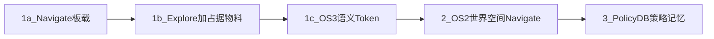

# 项目规划 — Demo 1

> **版本**：2026-08-19 · **规划单一入口**（做什么、按什么顺序、做到哪算过关）  
> 文档职责见 [readme.md](../../readme.md#文档职责)。  
> 目标系统结构见 **[架构_端侧系统架构.md](../架构/架构_端侧系统架构.md)**（三空间 OS / 技能 ABI；**不是**已完成清单）。  
> 边端契约：[边端协同接口规范.md](../项目规范/边端协同接口规范.md) · 运维/验收：[Demo阶段3D_runbook.md](../运维/Demo阶段3D_runbook.md) · [测试记录.md](../测试验收/测试记录.md)

工作包颗粒度与架构对齐：**一个技能或一条翻译面（OS0–OS4）= 一行**；实现细节（话题名、节点名）只写在关闭标准里。勾选只发生在本文。

---

## 0. 当前卡点（因果顺序）

未完成项按依赖往下排；**不要跳过**去做 1b / 1c / Token。

| 顺序 | ID | 架构锚点 | 卡点 | 状态 |
|------|----|----------|------|------|
| 1 | **1a-7 / SAFE-1** | `ReturnHome` | 断网/显式倒序返航真机 | 代码已接；**真机未走成** |
| 2 | **1a-8 / SAFE-2** | `RecoverGlass` | 虚拟障碍并入度量地图；`glass_trap`→返航 | 代码已接；真机未验收（08-19 短程关玻璃） |
| 3 | **1a-10** | OS4 度量侧重规划 | 执行中重规划 + 路径头可通行 | 待做（1b 长航时前置） |
| 4 | **1b** | `ExploreFrontier` + OS3 占据物料 | 地图淘汰可观测；frontier ≥30 min | 待做 |
| 5 | **1c / DEV-7** | OS3 语义物料 | TensorRT BEV + Token round-trip | 待做（无 engine 不算关闭） |
| 6 | **2-2 / DEV-6** | OS2 · `Navigate` | 世界空间任务调用同一 Navigate ABI 并到达 | 板载 waypoints 已通；**边端 JSON 未过** |

**已关闭（板载 `Navigate`，不经世界空间）：**

- 度量底座（历史 lean）：2026-08-07 / 08-14 走廊。
- 内核常驻预热：08-14。
- **Navigate 板载闭环**：2026-08-19 BOARD-CL，1.0 m / 0.43 m。测试记录 G0-4 / BOARD-CL。

**尚未关闭：** `ReturnHome` 真机、`RecoverGlass` 真机、世界空间 `Navigate`（EDGE-CL）、`ExploreFrontier`、OS3 Token、PolicyDB。

日常 `nav start` = 板载 `Navigate`（PCT 引导 → 技能运行时 `/initial_path` → SCAN）。这是技能实现，不是旁路。

---

## 1. 整体规划

### 1.1 目标

在 Go2 + Orin NX 上交付 **Demo 1**：把架构里的 **第一个原子技能 `Navigate`** 在嵌入式上做稳，并补齐同表技能 `ReturnHome` / `RecoverGlass` / `ExploreFrontier` 的可验收最小集；打开 OS3 物料面（Token）与 OS2 世界空间任务入口；PolicyDB 只归档 **行为策略与控制器选择**。端侧不做 text 实时决策，世界空间不得下发速度。

### 1.2 范围

| 纳入 Demo 1 | 明确不做（本 Demo） |
|-------------|---------------------|
| `Navigate` 度量内核 + 符号运行时 | 跨楼层 VLN 全栈 |
| `ReturnHome` / `RecoverGlass` 真机 | 端侧 text → 本地 Planner 闭环 |
| `ExploreFrontier` 长航时 + 占据物料淘汰 | 本地记忆/微调模型进决策链 |
| OS3：RGB-BEV→ENU + Token round-trip | 边端下发 `/cmd_vel` |
| OS2：世界空间任务 → 同一 Navigate ABI | Nav2 作主规划链 |
| PolicyDB 策略归档上送（不以路径点为主键） | **异构多机协同**（架构目标，本 Demo 不做） |
| | **完整世界模型差分调度**（本 Demo 只做 2-4 代数失效雏形） |
| | **Skill Registry / OS2 闭环 / 记忆查询 API / 监控树**（架构 §2.6；见本文 §6，不阻塞 §0 卡点） |
| | MCP、技能商店、跨本体群体、云端延迟竞赛 |

### 1.3 与架构的关系

| 架构条目 | Demo 1 填到哪 | 不在本 Demo 填 |
|----------|---------------|----------------|
| OS0 执行不下沉 | 全程门禁；1a-4 / A1–A5 | — |
| `Navigate` | **1a**（板载）→ **2-2**（世界空间入口） | — |
| `ReturnHome` | **1a-7** | — |
| `RecoverGlass` | **1a-8** | — |
| `ExploreFrontier` | **1b** | — |
| OS1 行为翻译（稳定终态） | **1a-9** 收口，**2** 与 **§6 RT-2** 必用 | — |
| OS2 决策翻译 | **2**（2-1b 物模型信封） | 世界模型本身；语音 ASR；电梯场景解算 |
| OS3 物料 | **1b** 占据代数；**1c** Token | — |
| OS4 技能 ABI / 非 RPC | **1a** ABI 雏形；**1a-10** 度量侧重规划；**2-4** 代数失效 | 完整世界状态调度器；**RT-1 Registry** 见 §6 |
| PolicyDB | **3** | 策略回灌端侧实时规划 |
| OS2 闭环 / 记忆面 / 监控树 | 信封字段在 **2-1c**；查询与再规划见 **§6** | 本 Demo 不做完整运行时 |
| 异构多机 | — | 本 Demo 不做 |

阶段规划 **推进** 架构落地，并 **只在本文勾选**。架构章节不得当成「已经做成」。

---

## 1.4 产品线切片（横切，不替换 1a→3）

对话中的五条 MVP 是垂直产品线。勾选仍只发生在 Step 1a/1b/1c/2/3。每个切片关闭须同时有 **P 性能** 与 **L 日志**（轨迹 + 策略摘要，不是只存折线）。

| 线 | Demo 1 填到哪 | 本轮已钉死 | 后置 |
|----|---------------|------------|------|
| **K** 度量内核 + 符号翻译 + JSON | K0=1a-5；K1=1a-10；K2=**2-1b 物模型** | 边端 JSON 必须含机器人/场景/策略/动作/模型 | 语音 K3、电梯 K4 → Demo 2 |
| **D** PolicyDB | 3-1/3-2 | 主键方向：`tid + mode_id + scene_type + outcome` | 回灌实时规划禁止 |
| **M** 边端中间件 | 端口 + 物模型信封 | services/events 角色对齐大疆；校验闸门 | 日常默认不起 uplink |
| **E** 边侧模型交互 | Step 2 联调 | 规范：模型必须出 mode，禁止出速度 | VLM 真模型 |
| **P+L** 横切 | 每切片关门 | 见测试记录模板 | 08-19 BOARD-CL 尚无正式 P 表 |

对照智源 RoboOS 的运行时缺口（技能库、闭环纠错、三类记忆、监控树）**不替换**上表，工作包见 **§6**，定义见架构 [§2.6](../架构/架构_端侧系统架构.md)。

---

## 2. 阶段总览

| 阶段 | 架构填充（一句话） | 验收 ID | 门禁 |
|------|-------------------|---------|------|
| **1a** | `Navigate` 板载闭环；同表 `ReturnHome`/`RecoverGlass` 真机不阻塞 1a 门禁但阻塞 1b | `V-D1-1a` | 进入 1b 前须 1a-1～1a-6；1a-7/8 须在 1b 长航时前 |
| **1b** | `ExploreFrontier` + OS3 占据物料可汰 | `V-D1-1b` | 进入 1c 前 |
| **1c** | OS3 语义物料 + Token 世界空间可解码 | `V-D1-1c` | **Step1 完成** = 1a∧1b∧1c |
| **2** | OS2：世界空间调用同一 `Navigate`；OS4 调度雏形 | `V-D1-2` | 进入 3 前 |
| **3** | PolicyDB：行为策略记忆上送世界空间 | `V-D1-3` | **Demo 1 结束** |

---

## 3. 阶段规划 — Step 1

### 3.1 Step 1a — `Navigate` 板载 + 同表安全技能

| ID | 架构锚点 | 工作包 | 关闭标准 | 状态 |
|----|----------|--------|----------|------|
| 1a-1 | `Navigate` 度量底座 | 定位 + 连续局部 + 跟踪 | 测试记录历史 lean；08-14 走廊仍可用 | ✅ 2026-08-07 |
| 1a-2 | OS2 雏形（无内核引导） | 世界空间定向到达 **不经 PCT** | ActionGroup NAV + feedback | ✅ 2026-08-07 |
| 1a-3 | OS0 / A2 | 度量内核与符号运行时同栈 | Gate0：PCT 与 BT 同在线 | ✅ 2026-08-12 干跑 |
| 1a-4 | A1 / OS4 | 内核不得写执行路径 | PCT 只出 `/global_path`；运行时写 `/initial_path` | ✅ 08-12 干跑；08-19 真机 |
| 1a-5 | `Navigate` 板载闭环 | 内核引导 + 运行时授权 + 局部执行 + 本体 | BOARD-CL 1.0 m / 0.43 m | ✅ 2026-08-19 |
| 1a-6 | `Navigate` 内核常驻 | C++ 预热 + 在线 A* | 预热 08-14；08-19 出 6 poses | ✅ |
| 1a-7 | `ReturnHome` | 面包屑倒序，不调世界模型、不调 PCT A* | 真机回到起点附近；测试记录 SAFE-1 | 代码已接；真机未过 |
| 1a-8 | `RecoverGlass` | 虚拟障碍并入 SCAN；`glass_trap` 转 `ReturnHome` | 真机可观测虚拟墙与恢复 | 代码已接；真机未过 |
| 1a-9 | OS1 | `Navigate` 终态枚举稳定 | 至少 `reached` / `stuck` / `plan_fail` / `glass_trap` / `link_lost` 可被反馈映射；**不是**随意 JSON 日志 | 待做（不阻塞 `V-D1-1a`） |
| 1a-10 | OS4 度量侧重规划 | 执行中内核重规划 + 路径头可通行 | 技能未结束时引导可更新；不可通行则失败而非直线抢跑 | 待做（**阻塞 1b**，不阻塞 `V-D1-1a`） |

**验收 `V-D1-1a`**：1a-1～1a-6 关闭即过。1a-7 / 1a-8 / 1a-10 不阻塞本门禁，**必须**在 1b 长航时前过。1a-9 在 `V-D1-2` 前关闭。证据：测试记录 Gate0 / BOARD-CL / SAFE-1。

### 3.2 Step 1b — `ExploreFrontier` + OS3 占据物料

| ID | 架构锚点 | 工作包 | 关闭标准 | 状态 |
|----|----------|--------|----------|------|
| 1b-1 | OS3 占据代数 | `session` / `context_generation` 版本化与滑动淘汰 | 淘汰可观测；旧代数技能须失效 | 待做 |
| 1b-2 | `ExploreFrontier` | frontier 选点驱动长航时游走 | ≥30 min 可复现；不依赖边端 NAV | 待做 |
| 1b-3 | OS3 子图物料 | 子图上行与位姿/代数对齐 | 世界空间能按代数对齐快照 | 待做（节点可起 ≠ 关闭） |
| 1b-4 | OS4 / 模式 A | 内核只作可选粗引导 | **不替代** frontier 选点 | 待做 |

**验收 `V-D1-1b`**：1b-1～1b-4。排在 1a-7、1a-8、1a-10 之后。

### 3.3 Step 1c — OS3 语义物料

| ID | 架构锚点 | 工作包 | 关闭标准 | 状态 |
|----|----------|--------|----------|------|
| 1c-1 | OS3 BEV | 单目 RGB→BEV **真网络（TensorRT）** | engine 在线推理；无 engine / stub **不算** | 待做 |
| 1c-2 | OS3 配准 | BEV 配准到 `world` / ENU | 与 LIO 可对齐 | 待做 |
| 1c-3 | OS3 语义地图 | 语义与占据强耦合的三维增量 | 与 1b-1 代数联动 | 待做 |
| 1c-4 | OS3 Token | 契约上行，世界空间可 decode | 真网络 round-trip；DEV-7 mock 不关闭 | 待做 |

**验收 `V-D1-1c`**：1c-1～1c-4。节点能起 **不关闭** 本阶段。

---

## 4. 阶段规划 — Step 2

世界空间任务叠在 Step1 技能表上（**不取消** `ExploreFrontier`）。**不再重复 1a-5**（板载写 `/initial_path` 已关闭）。

| ID | 架构锚点 | 工作包 | 关闭标准 | 状态 |
|----|----------|--------|----------|------|
| 2-1 | OS2 schema | 下行是技能调用（goal + session + generation），不是折线 | 旧 ActionGroup 仍可解析；校验失败 REJECT + 停车 | 代码有 schema；边端联调待做 |
| 2-1b | OS2 物模型 | 下行 `thing_envelope.v1`：机器人×场景×策略×动作×模型 | 缺任一块或错机型 → REJECT；禁速度/折线；单测关闭 | **schema 已落地**；边端联调待做 |
| 2-1c | OS2 生命周期 | 上行带 `mode_state` + `events` + `world_fragments` 引用 | INIT/ACTIVE/EXCEPTION/TERMINATED 可映射；内联几何拒 | **反馈字段已加**；真机事件链待 2-2 |
| 2-2 | OS2 · `Navigate` | 世界空间指令 → 同一 Navigate ABI → 到达 | 须用 2-1b 信封；事件链可见技能调度与 `pct_path_received`；EDGE-CL 可重复。代码无 `pct_nav_started` | **DEV-6 待复测** |
| 2-3 | 符号互斥 | `ExploreFrontier` vs `Navigate` 优先级 | 模式 A/B 可观测、可取消 | 待做 |
| 2-4 | OS4 符号/世界代数 | `session` / `context_generation` 不一致则技能失效 | 不是完整世界模型调度器 | 待做 |
| 2-5 | `Navigate` 性能 | 端到端延迟、算力、规划频率 | 报告归档 | 待做 |

**验收 `V-D1-2`**：2-1～2-5（含 2-1b/2-1c）；EDGE-CL 通过；`ExploreFrontier` 仍可独立验收。依赖：1a-9 → 2-1b → 2-2 → 2-4。

---

## 5. 阶段规划 — Step 3

| ID | 架构锚点 | 工作包 | 关闭标准 | 状态 |
|----|----------|--------|----------|------|
| 3-1 | PolicyDB | 归档 `mode_id`、场景、技能、控制器选择、成败码 | **不以** `/global_path` / 航点序列为主键；路径可作 `world_fragments` 附件 | 待做 |
| 3-2 | OS3/世界 ingest | 策略 bundle 上送世界空间 | 与 `command_id` / session 对齐 | 待做 |
| 3-3 | OS0 | 远端可 ingest；**不含**端侧 text 实时决策 | 验收范围声明 | — |

**验收 `V-D1-3`**：3-1～3-2；完整任务产生可解析策略 log → **Demo 1 结束**。

未来 Option（不在 Demo 1 门禁内）：本地记忆训练模型进入决策链；异构多机共享技能 ABI。OS 运行时 RT-1～RT-4 见 **§6**。

---

## 6. OS 运行时（对照智源，不阻塞 Demo 1）

定义见架构 [§2.6](../架构/架构_端侧系统架构.md#26-与智源-roboos-的对照目标态)。**不插入 §0 卡点**；须在 `V-D1-1a` 与 1a-9 之后设计，可与 Step 2 边端联调并行写 ABI，实现排在 EDGE-CL 之后或 Demo 2。

| ID | 架构锚点 | 工作包 | 关闭标准 | 状态 |
|----|----------|--------|----------|------|
| **RT-1** | OS4 Registry | 技能可注册：配额、超时、取消、同一 ABI 可替换实现 | 四个技能名不再只存在 BT if；换局部实现不改信封 `skill` 字段 | 待做 |
| **RT-1b** | 行为模式映射 | `mode_id` → 内核参数包（限速、玻璃感知、恢复策略） | 两个 mode 真机行为可区分；禁止 JSON 写速度 | 待做（依赖 RT-1） |
| **RT-2** | OS2 闭环 | 世界模型消费 `events.reason`，改 mode 或重发 execute | 至少 `glass_trap` / `plan_fail` / `link_lost` 各有一封再规划；端侧不跑大模型 | 待做（依赖 1a-9、2-1c） |
| **RT-3** | OS3 记忆面 | 同一 `bid` 查询空间 / 时间 / 本体记忆 | 空间=Token/子图引用；时间=mode 时间线；本体=`profile`+PolicyDB 摘要。端侧只生产，世界侧查询 | 待做（依赖 1c、3-1） |
| **RT-4** | 监控树 | `tid` → mode → skill → kernel digest 可映射 | 与 `/demo/lifecycle`、BT `ExecPhase` 分名对照表落地；边侧能按 tid 拉树 | 待做（依赖 2-1c） |

**明确不做（本条也不做）：** MCP、RoboSkill 式商店、跨本体群体、Scene Graph 多机共享、用 VLA 替换 PCT/SCAN、记忆回灌端侧实时规划。

分层任务 DAG 属世界空间，不单开端侧工作包。

---

## 7. 进度与历史对照

### 7.1 执行日志

| 日期 | 里程碑 |
|------|--------|
| 2026-08-07 | 1a-1 度量底座 + 1a-2 OS2 雏形（**不经内核引导**） |
| 2026-08-12 | 1a-3/1a-4 Gate0（内核与运行时共存、唯一执行写口） |
| 2026-08-13 | 内核单点 A*（1.2 m / 19 poses，`forwarder=false`） |
| 2026-08-14 | 底座走廊复测；内核预热通过 |
| 2026-08-19 | **1a-5 `Navigate` 板载闭环** BOARD-CL 1.0 m / 0.43 m |

### 7.2 旧文档映射（只读）

| 旧说法 | 现规划 |
|--------|--------|
| lean / 五阶段 Step1–2 | → **1a-1** `Navigate` 度量底座 |
| Gate0 / PCT 不直写 goal | → **1a-3 / 1a-4** |
| Step 5 PCT 联调 / BOARD-CL | → **1a-5**（板载 Navigate）；边端 → **2-2** |
| SAFE-1 返航 | → **1a-7** `ReturnHome` |
| 玻璃虚拟障碍 | → **1a-8** `RecoverGlass` |
| MVPI1 SEARCH | → **1b** `ExploreFrontier` |
| Token / v1 上行 | → **1c** OS3 |
| 执行中 PCT 重规划 | → **1a-10** |
| 代数 TTL / session 失效 | → **2-4** |
| PolicyDB 记路径 | → **禁止**；改记策略，见 **3-1** |
| `nav start-lean` | **已删除**；`nav start` = 板载 Navigate |

### 7.3 与测试记录 ID

| 规划 | 测试记录 |
|------|----------|
| 1a-3～1a-5 | G0-1～G0-4、BOARD-CL、PCT-ASTAR、SCAN-LOCAL、DEV-4/5 |
| 1a-7 | SAFE-1 |
| 2-1b | DEV-6a |
| 2-2 | DEV-6、EDGE-CL |
| 1c-4 | DEV-7 |
| 1b-2 / 耐久 | SOAK |
| 动态障碍（内核增强，非独立技能） | DYN-OBS；不单列阶段，随 Navigate 内核演进 |
| RT-1～RT-4 | 无测试记录 ID；未实现前不得写入「通过」 |

---

## 8. 相关入口

文档职责见 [readme.md](../../readme.md#文档职责)。架构约束 OS0–OS4、A1–A5、§2.6 RT-1～RT-4 以架构文档为准。
